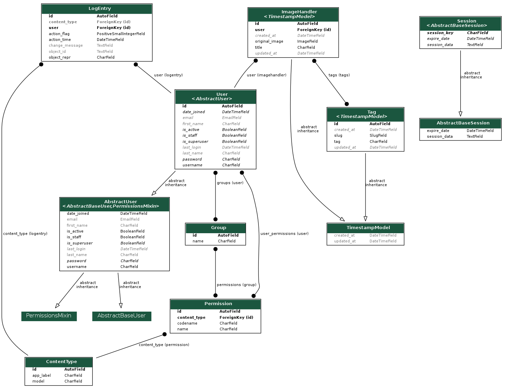

# Basic Architecture of Image Keeper

This file gives how the app works.

## High Level overview

The logged in user sends a mutation with an image. The Django backend verifies all the details and save the image entry in the database and upload the image to AWS S3 bucket. A user can also search for any image based on different parameters like name , tags , user.

## Technologies

- [Python](https://www.python.org/) as the programming language
- [Django](https://www.djangoproject.com) as the web framework
- [GraphQL](https://graphql.org/) as the api interface
- [PostgreSQL](https://www.postgresql.org/) as the database
- [AWS S3 bucket](https://aws.amazon.com/s3/) for storing images

I used Django as i could up and running in a few minutes as it provides most of the boilerplate code. Django ORM for interacting with the database is also preety good in my opinion which helped skip writing SQL queries.AWS has a free tier plan for S3 so that was the ovious choice. GraphQL with relay spec was choosed as I was quite familiar with it and GraphQL also provides several advantages at client side.

## Flow of the Application

There is only one end point '/graphql'. All requests are sent to this.

1. The user sends in the input detail for registering using createUser mutation.
2. Then user can request JWT token by using tokenAuth mutation. It also sets an HTTP only cookie for the token.
3. The user sends the image via uploadSingleImage mutation and any additional tags with it.This return details about the image. which includes its title , any tags , public url that is live for 1 hour.
4. At the backend Django handles preety much everything from uploading the image to S3 to saving it in the database. Exsisted tags are searched through the database or new ones are created and attached with the image object using many to many relation.
5. User can retrieve all image details using allImages. He can filter out his request using on parameters like title or change the order. Pagination can also be done using cursor.
   6.searchImages query can be used to search images based on a search term. Entire database is searched with matching search term on usernames , tags or titles. Django ORM comes in handy here and PostgreSQL search is implemented.

## Work Left

- Write more tests for graphql queries and mutations.
- Extract meta data from the images and use them also as tags.

## Future work

- Create multiple sized of the same image to optimizer requests using AWS Lambda functions.
- Add elastic search for more fast searching.
- Add redis cache for frequent queries.
